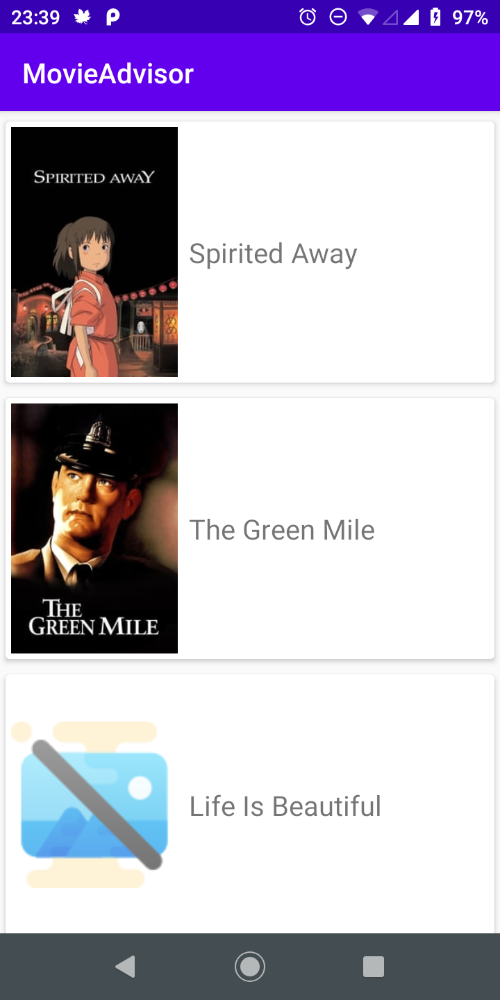
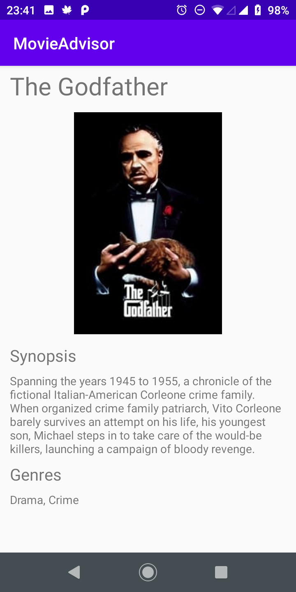

# Movie Advisor

## Description
This is an Android app that shows movie recommendations. All the information are fetched from an HTTP-based RESTful API and cached for offline access.

Screen of movie recommendations:

Screen of movie details:

The app was developed using the Android Studio.

## Tech stack
* Java
* Volley, for JSON requests and caching
* Picasso, for image requests and caching
